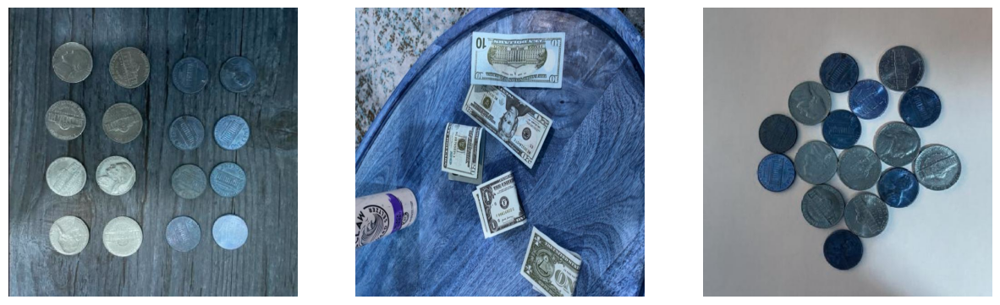
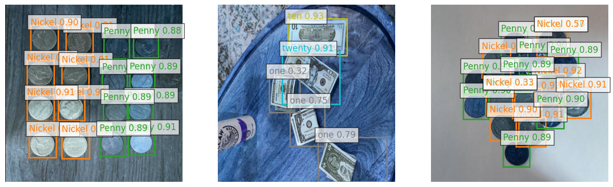
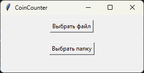
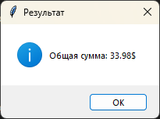

# CoinCounter

CoinCounter — это проект для подсчета суммы денег на фотографии с использованием машинного обучения. Проект разработан для демонстрации навыков в области компьютерного зрения.

## Описание

CoinCounter принимает на вход фотографию с изображением монет и купюр и использует модель машинного обучения для детекции объектов, чтобы определить и подсчитать сумму денег в долларах. Проект включает графический интерфейс и программный интерфейс для доступа к модели машинного обучения.

Вход модели:

Выход модели:


## [Опробовать модель](https://huggingface.co/spaces/ytkoa/CoinCounter)

## Описание файлов

**[`main.py`](main.py)**  
Основной файл для запуска графического интерфейса CoinCounter. Позволяет выбирать изображения или папки и обрабатывать их для подсчета денег.

**[`tutorial.ipynb`](tutorial.ipynb)**  
Jupyter ноутбук с инструкциями по использованию программного интерфейса и демонстрацией его возможностей.

**[`metric.ipynb`](metric.ipynb)**  
Jupyter ноутбук с метриками и результатами оценки модели.

**`data/`**  
Папка с тестовыми изображениями для демонстрации работы модели и графического интерфейса.


## Установка

1. Клонируйте репозиторий:
    ```bash
    git clone https://github.com/ivanovot/CoinCounter.git
    ```

2. Перейдите в директорию проекта:
    ```bash
    cd CoinCounter
    ```

3. Установите зависимости:
    ```bash
    pip install -r requirements.txt
    ```

## Графический интерфейс

1. Запустите приложение:
    ```bash
    python main.py
    ```

2. В графическом интерфейсе нажмите кнопку "Выбрать файл" для выбора одиночного изображения или "Выбрать папку" для выбора папки с изображениями.  
  


3. Подождите, пока приложение обработает изображения и подсчитает сумму денег.

4. Результат будет отображен в графическом интерфейсе после завершения процесса.
  


## Программный интерфейс

Модуль `CoinCounter` предоставляет следующие возможности:

- **Детекция объектов**: Автоматическое обнаружение монет на фотографии с использованием модели машинного обучения.
- **Подсчет суммы**: Расчет общей суммы денег на изображении, основанный на детекции монет.
- **Настройка параметров**: Возможность настройки порогов уверенности и перекрытия для точности предсказаний.
- **Обработка изображений**: Поддержка обработки одиночных изображений или папок с изображениями.
- **Визуализация результатов**: Отображение изображений с аннотациями и размеченными объектами.

Эти функции позволяют легко интегрировать и использовать модель для подсчета денег из фотографий в различных приложениях.

- **Подробное описание** и пример использования графического интерфейса в **[туториале](tutorial.ipynb)**

---

## Информация о проекте

- **Язык программирования**: Python 3.12
- **Архитектура модели**: Использована модель YOLOv8s, архитектура взята из [ultralytics/ultralytics](https://github.com/ultralytics/ultralytics).
- **Датасет**: Для обучения модели использовался датасет [Cash Counter](https://universe.roboflow.com/alex-hyams-cosqx/cash-counter)
